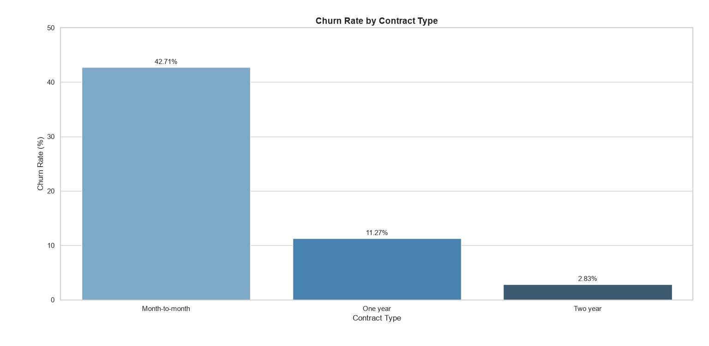
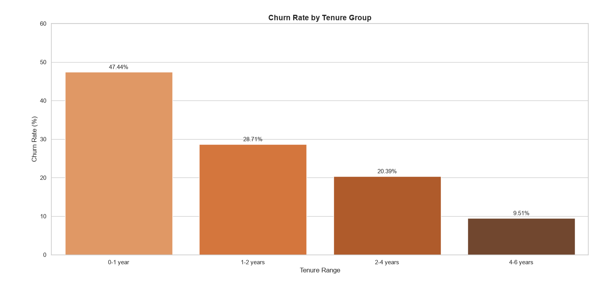
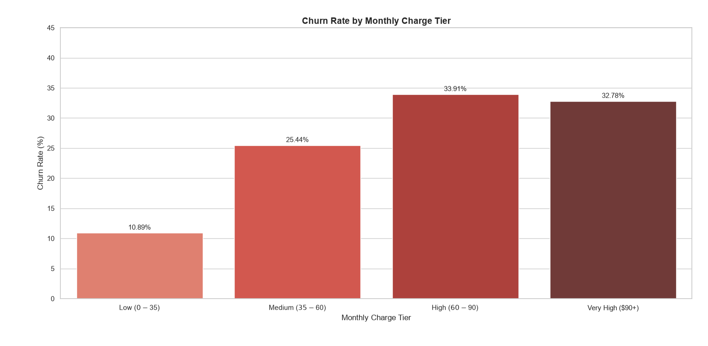

# Telco Customer Churn Analysis


Pandas analysis of 7,043 telecom customers to identify key drivers behind customer churn - Contract type, tenure, and pricing — with visualizations to support retention strategy.


## Pipeline


- **Cleaning** → Parsed TotalCharges (stored as string) into numeric, converting blanks to NaN; imputed missing values using each customer's MonthlyCharges (new customers with 0 tenure)
- **Feature engineering** → Bucketed tenure and MonthlyCharges into business-relevant tiers using pd.cut()
- **Analysis** → Computed segment-level churn rates via vectorized boolean aggregation ((x == 'Yes').mean() * 100)
- **Visualization** → Built churn-rate bar charts by contract type, tenure group, and charge tier using Matplotlib/Seaborn

  
## Key Findings


- **Baseline churn rate:** 26.54% overall across 7,043 customers

- **Contract length risk:** Month-to-month customers churn at 42.71%, vs. 11.27% for one-year and just 2.83% for two-year contracts — contract length is one of the strongest churn predictors

- **Tenure risk:** New customers (0-1 year) churn at 47.44%, dropping steadily to 28.71% (1-2 years), 20.39% (2-4 years), and 9.51% (4-6 years) — risk is highest in the first year and falls sharply with loyalty

- **Price sensitivity:** Churn rises from 10.89% in the lowest charge tier ($0-35) to 33.91% in the $60-90 tier, with Very High ($90+) slightly lower at 32.78% — churn risk jumps once charges cross ~$60/month

## Visualizations






## Tech Stack

- Python 
- Pandas 
- Matplotlib 
- Seaborn


## Project Structure

```bash
├── data/                → Telco churn CSV 
├── charts/              → Churn-rate visualizations (PNG)
├── churn_analysis.py    → Cleaning, analysis, and chart generation
├── LICENSE              → MIT license  
└── README.md            → Project documentation 
```